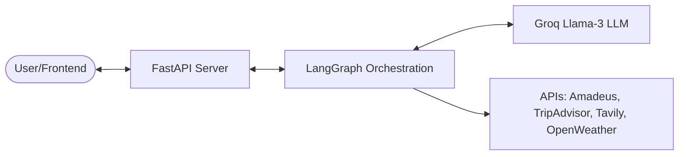
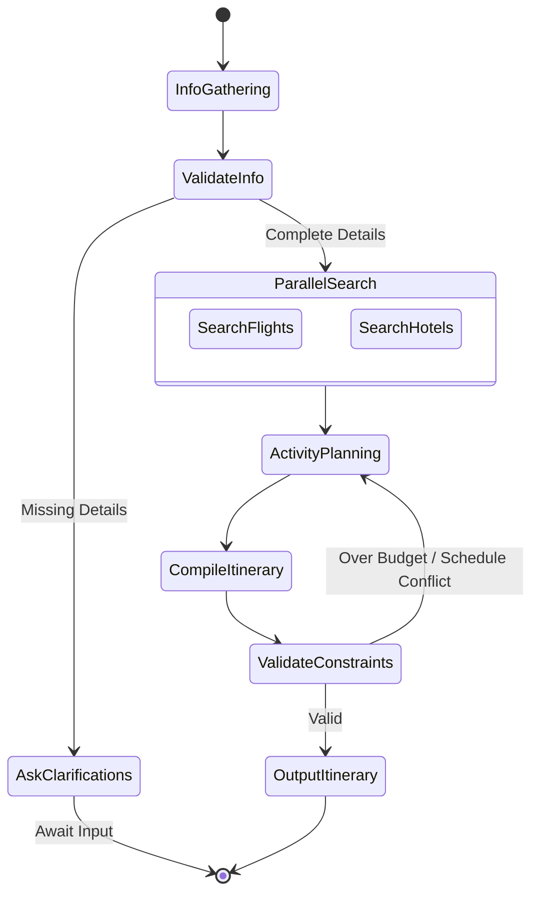

# AI Smart Travel Planner (LangGraph + Groq)

A modular, scalable AI-powered Travel Planner using **LangGraph** for workflow orchestration, **Groq (Llama-3)** for fast inference, and **FastAPI** as the backend API layer.

---

## 1. Folder Structure

```text
travel_planner/
├── .env.example                 # Environment variables template
├── requirements.txt            # Project dependencies
├── README.md                   # Project documentation
├── main.py                     # FastAPI server entrypoint
├── config.py                   # Configuration manager
└── src/
    ├── graph/                  # LangGraph state & workflow logic
    │   ├── state.py            # Graph State schema
    │   ├── workflow.py         # Graph compilation & routing
    │   └── nodes/              # Node implementation logic
    │       ├── info_gatherer.py
    │       ├── flight_searcher.py
    │       ├── hotel_searcher.py
    │       ├── activity_planner.py
    │       └── itinerary_compiler.py
    ├── tools/                  # Executable tools for agents
    │   ├── flights.py          # Amadeus Flight API wrapper
    │   ├── hotels.py           # TripAdvisor API wrapper
    │   ├── activities.py       # Tavily Search API wrapper
    │   └── weather.py          # OpenWeatherMap API wrapper
    └── services/               # Clients (Groq, HTTP base client)
```

---

## 2. System Architecture



---

## 3. LangGraph Workflow



---

## 4. Nodes & Tools Reference

| Component Type | Name | Inputs / Parameters | Role / Output |
| :--- | :--- | :--- | :--- |
| **Node** | `info_gatherer` | `messages`, `trip_details` | Validates & extracts travel parameters. |
| **Node** | `flight_searcher` | `trip_details` | Invokes flight search; updates `flight_options`. |
| **Node** | `hotel_searcher` | `trip_details` | Invokes hotel search; updates `hotel_options`. |
| **Node** | `activity_planner` | `trip_details`, `weather` | Curates activity options; updates `activity_options`. |
| **Node** | `itinerary_compiler` | `flight/hotel/activity_options` | Combines options into formatted markdown itinerary. |
| **Tool** | `search_flights_tool` | `origin`, `dest`, `dates`, `budget` | Returns flights via Amadeus API. |
| **Tool** | `search_hotels_tool` | `location`, `dates`, `budget` | Returns lodgings via TripAdvisor/Tavily. |
| **Tool** | `get_weather_tool` | `location`, `dates` | Returns weather details via OpenWeatherMap. |
| **Tool** | `search_activities_tool`| `location`, `keywords` | Returns attraction lists via Tavily. |

---

## 5. API Endpoints (FastAPI)

| Method | Endpoint | Description | Request Body Payload Example |
| :--- | :--- | :--- | :--- |
| **`POST`** | `/api/v1/trips` | Starts a planning thread. | `{"destination": "Paris", "budget": 2000, "days": 5}` |
| **`POST`** | `/api/v1/trips/{thread_id}/chat` | User communicates/updates constraints. | `{"message": "I want a cheaper hotel near central area"}` |
| **`GET`** | `/api/v1/trips/{thread_id}/itinerary`| Retrieves compiled itinerary. | *None* |
| **`POST`** | `/api/v1/trips/{thread_id}/approve` | Freezes/finalizes itinerary state. | *None* |

---

## 6. Development Roadmap

- [ ] **Phase 1 (Setup)**: Environment setup, dependency installation, and Groq API baseline tests.
- [ ] **Phase 2 (State & Graph)**: Define Pydantic state models (`state.py`) and build graph architecture (`workflow.py`).
- [ ] **Phase 3 (Nodes & Tools)**: Implement search tools & integrate LLM-driven nodes.
- [ ] **Phase 4 (REST API)**: Develop FastAPI route handlers & persistence adapters (SQLite checkpointing).
- [ ] **Phase 5 (Refinement)**: Design correction loop for validation errors and test budgets.
